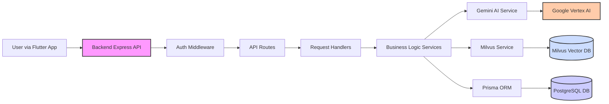

# LearnAbility: Personalized & Accessible Learning 🚀

   

**Important Backend Notice:**
> The backend code (API, database setup, AI service integration) resides in its own repository. Please refer to the [**LearnAbility Backend Repository**](https://github.com/0xteamCookie/LearnAbility-backend) for backend setup instructions and code. You will need to have the backend services running for the frontend application to function fully.

**Google Solution Challenge Submission | Addressing UN SDG 4: Quality Education 🌍**

---

## 🤔 The Challenge: Education for All

Access to quality education remains a challenge for many, especially in underserved communities and for students with diverse learning needs. Limited resources and one-size-fits-all approaches hinder potential. Our goal is to help bridge this gap, aligning with **UN SDG 4**.

## ✨ Our Solution: LearnAbility

Meet LearnAbility – your personalized learning co-pilot! 🧑‍✈️ We're transforming how students learn using AI to turn standard course materials (notes, PDFs, etc.) into tailored, interactive lessons.

**Key Ideas:**
*   🧠 **Personalized Paths:** Content adapts to individual learning styles and pace.
*   ♿ **Accessibility Core:** Built with features for visual, auditory, and cognitive accessibility.
*   📱 **Mobile First:** Delivered through a cross-platform Flutter application.

We aim to provide an equitable and engaging learning experience for every student.

## 🌟 Core Features

*   🤖 **AI Content Generation:** Automatically creates lessons, quizzes, and summaries from your uploaded materials (notes, PDFs, etc.).
*   📈 **Adaptive Learning:** Intelligently adjusts content difficulty and provides personalized feedback based on your progress.
*   ♿ **Accessibility Suite:** Includes high-contrast themes, adjustable text sizes, dyslexia-friendly fonts (like OpenDyslexic), text-to-speech output, and potential for voice navigation.
*   🎮 **Interactive Learning:** Offers engaging lesson formats, dynamic quizzes, and visual progress tracking to keep you motivated.
*   🔍 **Smart Search:** Leverages vector search (Milvus) to quickly find the most relevant information within your study materials.

## ✨ App Showcase

*(Add your screenshots and GIFs here!)*

## 🛠️ Technology Stack

*   **Frontend:** Flutter, Dart 📱
*   **Backend:** Node.js, Express.js, TypeScript ⚙️
*   **Database:** PostgreSQL, Milvus (Vector DB) 💾
*   **AI:** Google Vertex AI (Gemini API, RAG) 🧠
*   **Validation:** Zod (Backend) ✅
*   **Authentication:** JWT 🔑
*   **Containerization:** Docker & Docker Compose (for Backend Services) 🐳

## 🏗️ Architecture Overview

The application consists of a Flutter frontend communicating with a Node.js backend API. The backend handles business logic, data storage, and AI interactions.

*   The backend uses Prisma ORM for PostgreSQL, Milvus for vector search, and Google Vertex AI (Gemini) for AI tasks.

## 🚀 Getting Started (Overview)

This repository contains the **Flutter Frontend** for LearnAbility. The backend service is maintained in a separate repository.

**Important Backend Notice:**
> The backend code (API, database setup, AI service integration) resides in its own repository. Please refer to the [**LearnAbility Backend Repository**](https://github.com/0xteamCookie/LearnAbility-backend) for backend setup instructions and code. You will need to have the backend services running for the frontend application to function fully.

**Frontend Setup:**

1.  Ensure you have the [Flutter SDK](https://flutter.dev/) installed.
2.  Clone this repository: `git clone https://github.com/0xteamCookie/LearnAbility.git`
3.  Navigate to the project directory: `cd LearnAbility`
4.  Install dependencies: `flutter pub get`
5.  **Ensure the backend services are running** (see the [Backend Repository](https://github.com/0xteamCookie/LearnAbility-backend) for instructions).
6.  Run the Flutter application: `flutter run` (select your target device/emulator).

*(Prerequisites: Flutter, Dart, Git. See backend repository for its prerequisites like Node.js, Docker)*

## 🔗 Project Repositories

*   **Frontend (This Repository):** [https://github.com/0xteamCookie/LearnAbility](https://github.com/0xteamCookie/LearnAbility)
*   **Backend Repository:** [https://github.com/0xteamCookie/LearnAbility-backend](https://github.com/0xteamCookie/LearnAbility-backend)

## 🍪 Meet the Team: teamCookie()

*   **[shaunakc11](https://github.com/shaunakc11)** - Full Stack Developer | AI Engineer
*   **[0xPixelNinja](https://github.com/0xPixelNinja)** - Backend Developer
*   **[Kathrina-dev](https://github.com/Kathrina-dev)** - Frontend and UI/UX Designer
*   **[pranjal-kumar-0](https://github.com/pranjal-kumar-0)** - Frontend and UI/UX Designer

## 📜 License

Licensed under the **GNU General Public License v3.0**.
